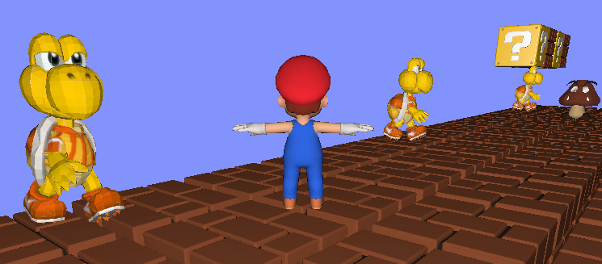
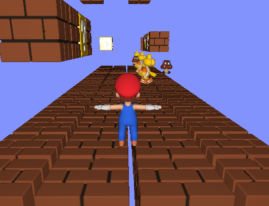
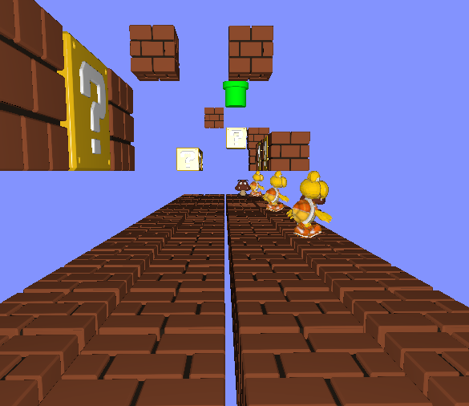
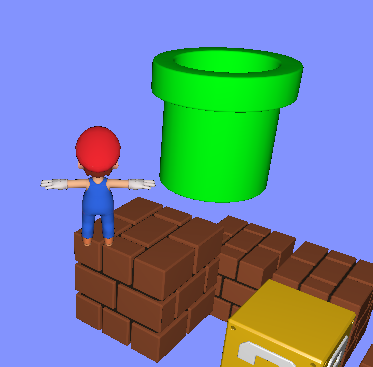

# Trabalho Final INF01047 - Fundamentos de Computação Gráfica (FCG) - 2024/1

## Visão Geral
Trabalho final da cadeira de fundamentos de computação gráfica, onde será desenvolvido um jogo em C/C++ utilizando a biblioteca OpenGL

O jogo é baseado no clássico "Super Mario", porém feito em 3D e em uma versão (muito) mais enxuta do que a original.

Definições:
* O objetivo do jogo é atravessar o mapa, desviando de obstáculos, como buracos e inimigos ("Koopa" e "Goomba") no meio do caminho, até chegar ao tudo verde que leva para o próximo mapa.
* O jogo possui 3 mapas diferentes, e não há telas de carregamento entre os mapas.
* Caso o jogador caia em algum buraco ou encoste em algum inimigo, ele será mandado de volta para o início do mapa como uma penalização.

---------------------------------------------------------------------------------------------------------------------------------------------------------------------------------------------------------------------------------------------------------------------
## Contribuição de cada Integrante:
O trabalho foi realizado pelos alunos:
- Gustavo Lacroix
- Mateus Kienzle

Distruição das atividades:
- Malhas Poligonais Complexas [ Realizada por Gustavo ]
- Transformações Geométricas Controladas pelo Usuário [ Realizada por Gustavo e Mateus ]
- Modelos de Interpolação de Phong e Gouraud [ Realizada por Gustavo ]
- Movimentação com curva Bézier cúbica [ Realizada por Mateus ]
- Animações baseadas no tempo [ Realizada por Gustavo e Mateus ]
- Camera livre e camera look-at [ Realizada por Gustavo e Mateus ]
- Três tipos de testes de intersecção [ Realizada por Gustavo ]
- Modelos de Iluminação Difusa e Blinn-Phon [ Realizada por Gustavo ]
- Mapeamento de texturas em todos os objetos [ Realizada por Gustavo e Mateus ]
- Instâncias de objetos [ Realizada por Mateus ]

---------------------------------------------------------------------------------------------------------------------------------------------------------------------------------------------------------------------------------------------------------------------
## Utilização de auxílio de Inteligência Artificial

  - Durante a realização do trabalho foi utilizado o auxílio do CHAT GPT 3.5 . A ferramenta foi utilizada para consultas sobre a sintaxe da linguagem C++. Além disso, foi útil em auxiliar em alguns raciocínios para desenvolver porções de código.

  - Em alguma vezes a ferramenta se demonstrou acertiva com as respostas, contribuindo para a realização e facilitação do trabalho. Algumas vezes a ferramenta não foi capaz de ajudar plenamente, exigindo que outras fontes de conhecimento na internet fossem exploradas, como o StackOverflow.

---------------------------------------------------------------------------------------------------------------------------------------------------------------------------------------------------------------------------------------------------------------------
## Implementações dos conceitos de Computação Gráfica
### Processamento das fases:
  * Cada fase está contida dentro de um laço for , onde é instanciado n objetos. Modifica-se a posição x, y  e Z desses objetos a para criar padrões distintos entre as fases do jogo

### Interação com o usuários
   O jogo disponibiliza interação com usuário em tempo real, para isso foi utilizada funções disponíveis pela biblioteca GLFW, como , por exemplo:
     * [     glfwSetKeyCallback     ]
     * [ glfwSetMouseButtonCallback ]
     * [  glfwSetCursorPosCallback  ]
     * [  glfwSetScrollCallback     ]
  Cada uma dessas funções recebe como parametro uma outra função Callback -  programadas para responder cada ação específica previstas pelos desenvolvedor. Podemos citar, a função KeyCallback , a qual sempre será chamada quando um usuário pressionar alguma tecla do teclado. Essa função ajusta variáveis de controle de movimentação , mudanças na transformação geométrica de objetos específicos da cena virtual, entre outras coisas.

Para o controle do mouse e suas derivações, as funções glfwSetScrollCallback , glfwSetMouseButtonCallback, glfwSetCursorPosCallback recebem funções Callback específicas para cada uma das suas aplicações:

* A função glfwSetCursorPosCallback recebe a função Callback CursorPosCallback - função callback chamada sempre que o usuário movimentar o cursor do mouse em cima da janela OpenGL.

 * A função glfwSetScrollCallback recebe como Callback a função ScrollCallback, a qual sempre é chamada quando o usuário movimenta o scroll do mouse ( " rodinha " ).

 * A função glfwSetMouseButtonCallback recebe como função callback a função MouseButtonCallback, a qual sempre é chamada quando um dos botões do mouse é clicado. 

### Movimentação com Curva Bézier Cúbica Curva de Bezier e Animações Baseadas no Tempo
 * A função bezierCurve foi utilizada na movimentação do "Koopa", um dos inimigos do Mario.

### Modelos de Interpolação de Phong e Gouraud
  * Foram utilizados esses modelos de iluminação em alguns objetos, como o "Cubo Amarelo" e o "Tubo verde". 

### Colisões
  * O jogo possui 3 tipos de colisões:
    - Colisão ponto cubo - Utilizada para detectar a colisão entre o Mario e os cubos flutuantes.

    - Colisão ponto plano - Utilizada para garantir que o Mario esteja em contato com a plataforma do chão do mapa, composta por cubos.

    - Colisão ponto esfera.

---------------------------------------------------------------------------------------------------------------------------------------------------------------------------------------------------------------------------------------------------------------------

## Preview do Jogo
- Malhas Poligonais Complexas

- Camera look-at:

- Camera free-cam:

- Tubo verde para ir para o próximo mapa

---------------------------------------------------------------------------------------------------------------------------------------------------------------------------------------------------------------------------------------------------------------------
## Tutorial de Uso do jogo.

### Movimentação:
  - W : para mover-se para frente
  - A : para mover-se para a esquerda
  - S : para mover-se para trás
  - D : para mover-se para direita
  - ESPAÇO : para pular

### Atalhos de interação
  - F : para ativar camera free-cam
  - L : para voltar para a camera look-at

# Como rodar o jogo 

## Opção 1
- 1) Faça donwload do zip pelo GitHub
- 2) Extraia o arquivo compactado no seu diretório de preferência
- 3) Acesse a pasta bin -> Acesse Debug -> Abra o arquivo main.exe

## Opção 2
- 1) Faça donwload do zip pelo GitHub
- 2) Extraia o arquivo compactado no seu diretório de preferência
- 3) Abra a IDE Codeblocks
- 4) Vá na aba "File" ( No canto superior esquerdo da IDE )
- 5) Clique em "Open"
- 6) Entre na pasta que você extraiu -> Abra o arquivo Laboratorio_5.cbp
- 7) Clique no ícone azul para buildar o programa novamente e logo em seguida clique no botão de Play.

  

